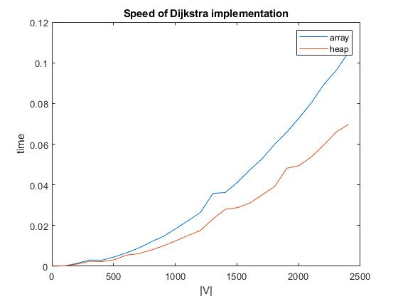

# AD_HW_08
Last homework for the Algorithm Design course at DSSC a.y. 2019/2020

## Last Homework
29/06/2020

I implemented Dijkstra's algorithm by arrays. I represented the graph as an array of nodes with a dense Adjacency matrix, which in this case it is a density matrix. I reused the code from the Strassen Algorithm, and I assumed that negative weights presumed no connection(so $u\in Adj\{v\}$ iff WeightMatrix[v][u]>=0). If the random number is genreated uniformly, the number of edges is around $|E| \approx \frac{|V|^2}{2}$. 

The execution time of this code should then be $O(|V|^2+|E|)=O(|V|^2)$.

Then I implemented it by heaps. The execution time of this code should then be $O((|V|+|E|)log|V|)=O(|V|^2log |V|)$. We see the plot:

The heap implementation is slightly better than the array one.

In the test folders I tested the graph we had on Lecture.